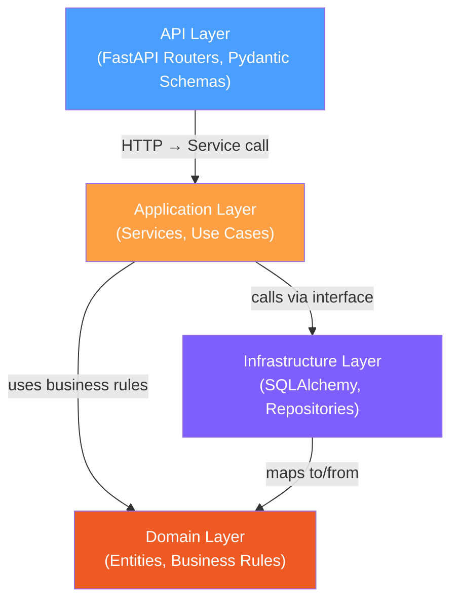

# Financial Ledger API

A double-entry bookkeeping financial ledger built with FastAPI, SQLAlchemy, and PostgreSQL.

## Table of Contents

- [Overview](#overview)
- [Architecture](#architecture)
- [Design Decisions](#design-decisions)
- [Quick Start](#quick-start)
- [Local Development](#local-development)
- [Running Tests](#running-tests)
- [API Usage](#api-usage)
  - [Health Check](#health-check)
  - [Create Account](#create-account)
  - [List Accounts](#list-accounts)
  - [Get Account](#get-account)
  - [Create Transaction](#create-transaction)
  - [Get Transaction](#get-transaction)
  - [Get Account Transactions](#get-account-transactions)
- [Code Quality](#code-quality)
- [Project Structure](#project-structure)
- [What Could Be Improved](#what-could-be-improved)
- [Documentation](#documentation)

## Overview

The system enforces double-entry bookkeeping rules: every transaction must have at least one debit and one credit entry, and total debits must equal total credits. Account balances are computed via SQL aggregation (no cached balance column), ensuring consistency without synchronization issues.

**Key features:**

- 4 account types: Asset, Liability, Revenue, Expense
- Automatic balance calculation with correct normal-balance semantics
- Full validation of double-entry constraints before persisting
- Alembic migrations applied automatically on startup
- 132 tests (unit, integration, API) with real PostgreSQL via testcontainers

## Architecture

The project follows Clean Architecture with four layers:



- **Domain** -- pure Python entities and validation rules; no framework dependencies
- **Application** -- service layer orchestrating domain logic and repository calls
- **Infrastructure** -- SQLAlchemy ORM models, async repositories, DB engine setup
- **API** -- FastAPI routers, Pydantic request/response schemas, exception handlers

## Design Decisions

| Decision | Choice | Why |
|---|---|---|
| Architecture | Clean Architecture (4 layers) | Testability; domain logic runs without DB or HTTP |
| Balance computation | SQL aggregation (`SUM` with `CASE`) | No N+1 queries, constant memory, always consistent |
| Dependency management | uv | 10-50x faster than pip/Poetry, lockfile, Docker-friendly |
| Testing strategy | Testcontainers (real PostgreSQL) | No mocks for DB; tests catch real SQL issues |

See [Architecture Decision Records](docs/README.md#architecture-decision-records) for full rationale.

## Quick Start

**Prerequisites:** Docker and Docker Compose.

```bash
git clone <repo-url>
cd illuminati
make up
```

The API starts at `http://localhost:8000` and the frontend at `http://localhost:3000`. Database migrations run automatically on first startup.

Verify it works:

```bash
curl http://localhost:8000/health
# {"status":"ok"}
```

Load sample data (optional):

```bash
make seed-data
```

This creates 10 accounts and 7 transactions covering common bookkeeping scenarios. See [Use Cases](docs/use-cases.md) for details.

Stop:

```bash
make down
```

## Local Development

All dependencies live inside Docker -- no local venv required.

Run `make help` to see all available targets with descriptions.

```bash
# Build the image
make build

# Start services (app + postgres)
make up

# Stop services
make down
```

Use `docker compose run --rm app <command>` to run commands inside the container.

### Database Management

```bash
make db-migrate                            # Apply pending migrations
make db-revision msg="add user table"      # Generate new migration
make db-shell                              # Open psql in Postgres container
make db-reset                              # Drop all data + re-migrate (confirms first)
make db-dump                               # Backup to timestamped .sql file
make db-restore file=dump_20260305.sql     # Restore from backup
```

## Running Tests

Tests use testcontainers to spin up an isolated PostgreSQL instance per session:

```bash
make test
```

Or directly:

```bash
docker compose run --rm app pytest -v
```

Test structure:

| Layer | Path | What it tests |
|---|---|---|
| Unit | `tests/unit/` | Domain models, validation, balance logic (no DB) |
| Integration | `tests/integration/` | Repository layer with real PostgreSQL |
| API | `tests/api/` | Full endpoint tests with httpx TestClient |

## API Usage

### Health Check

```bash
curl http://localhost:8000/health
```

### Create Account

```bash
curl -X POST http://localhost:8000/api/accounts \
  -H "Content-Type: application/json" \
  -d '{"name": "Cash", "type": "ASSET"}'
```

Account types: `ASSET`, `LIABILITY`, `REVENUE`, `EXPENSE`.

### List Accounts

```bash
curl http://localhost:8000/api/accounts
```

### Get Account

```bash
curl http://localhost:8000/api/accounts/<account-id>
```

### Create Transaction

```bash
curl -X POST http://localhost:8000/api/transactions \
  -H "Content-Type: application/json" \
  -d '{
    "description": "Purchase office supplies",
    "date": "2024-01-15T10:30:00",
    "entries": [
      {"accountId": "<debit-account-id>", "type": "DEBIT", "amount": 100.00},
      {"accountId": "<credit-account-id>", "type": "CREDIT", "amount": 100.00}
    ]
  }'
```

Rules enforced:
- At least 2 entries (minimum 1 debit + 1 credit)
- Total debits must equal total credits
- All amounts must be positive
- All referenced accounts must exist

### Get Transaction

```bash
curl http://localhost:8000/api/transactions/<transaction-id>
```

### Get Account Transactions

```bash
curl http://localhost:8000/api/accounts/<account-id>/transactions
```

## Code Quality

```bash
# Lint
make lint

# Format
make format

# Type check
make typecheck

# All checks
make check
```

Tools: [Ruff](https://docs.astral.sh/ruff/) (linting + formatting), [mypy](https://mypy-lang.org/) (strict type checking).

## Project Structure

```
src/ledger/
├── main.py                          # FastAPI app factory
├── api/
│   ├── routers/
│   │   ├── accounts.py              # Account endpoints
│   │   └── transactions.py          # Transaction endpoints
│   ├── schemas.py                   # Pydantic request/response models
│   ├── dependencies.py              # Dependency injection
│   └── exception_handlers.py        # Error → HTTP status mapping
├── application/
│   ├── account_service.py           # Account use cases
│   ├── transaction_service.py       # Transaction use cases
│   └── interfaces.py               # Repository interfaces (ABC)
├── domain/
│   ├── models.py                    # Account, Transaction, TransactionEntry
│   ├── enums.py                     # AccountType, EntryType
│   ├── exceptions.py               # Domain exceptions
│   └── services.py                  # Balance calculation, validation
└── infrastructure/
    ├── database.py                  # Engine + session factory
    ├── models.py                    # SQLAlchemy ORM models
    ├── mappers.py                   # ORM ↔ domain model mappers
    └── repositories/
        ├── account_repo.py          # Account repository
        └── transaction_repo.py      # Transaction repository
```

## What Could Be Improved

- **Pagination** -- list endpoints return all records; add cursor-based pagination
- **Authentication** -- no auth layer; add JWT or API key middleware
- **Audit trail** -- soft deletes + updated_at timestamps for compliance
- **Rate limiting** -- protect against abuse with request throttling
- **Observability** -- structured logging, OpenTelemetry traces, Prometheus metrics
- **CI/CD** -- add deployment pipeline (currently CI runs tests + lint only)
- **API versioning** -- prefix routes with `/v1/` for future compatibility

## Documentation

Detailed documentation is available in the [`docs/`](docs/README.md) directory:

- [Architecture](docs/architecture.md) -- layers, dependency rules, request flow
- [Domain Model](docs/domain-model.md) -- entities, balance rules, validation
- [API Specification](docs/api-specification.md) -- all endpoints with examples
- [Development Guide](docs/development-guide.md) -- workflow, TDD, migrations
- [Project Setup](docs/project-setup.md) -- tech stack, Docker, CI
