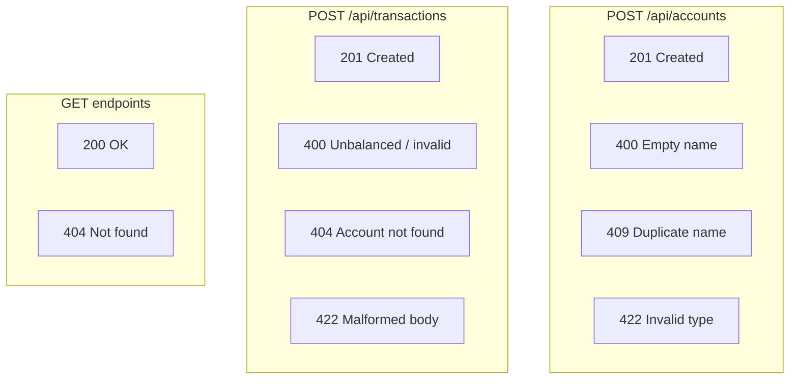

# API Specification

## Table of Contents
- [Overview](#overview)
- [Base URL](#base-url)
- [Common Response Formats](#common-response-formats)
- [Account Endpoints](#account-endpoints)
  - [POST /api/accounts](#post-apiaccounts)
  - [GET /api/accounts](#get-apiaccounts)
  - [GET /api/accounts/{id}](#get-apiaccountsid)
- [Transaction Endpoints](#transaction-endpoints)
  - [POST /api/transactions](#post-apitransactions)
  - [GET /api/transactions/{id}](#get-apitransactionsid)
  - [GET /api/accounts/{id}/transactions](#get-apiaccountsidtransactions)
- [Error Responses](#error-responses)
- [Related Documents](#related-documents)

## Overview

The Financial Ledger API exposes 6 REST endpoints for managing accounts and transactions. All request/response bodies use JSON. Monetary amounts are serialized as strings with 2 decimal places to avoid floating-point precision issues.

## Base URL

```
http://localhost:8000/api
```

## Common Response Formats

### Account Response

```json
{
  "id": "550e8400-e29b-41d4-a716-446655440000",
  "name": "Cash",
  "type": "ASSET",
  "balance": "1350.00",
  "createdAt": "2024-01-15T10:00:00"
}
```

> `balance` is always computed dynamically. See [Domain Model: Balance Calculation](./domain-model.md#balance-calculation).

### Transaction Response

```json
{
  "id": "7c9e6679-7425-40de-944b-e07fc1f90ae7",
  "description": "Purchase office supplies",
  "timestamp": "2024-01-15T10:30:00",
  "entries": [
    {
      "id": "entry-uuid-1",
      "accountId": "account-uuid-1",
      "type": "DEBIT",
      "amount": "100.00"
    },
    {
      "id": "entry-uuid-2",
      "accountId": "account-uuid-2",
      "type": "CREDIT",
      "amount": "100.00"
    }
  ],
  "createdAt": "2024-01-15T10:30:00"
}
```

---

## Account Endpoints

### POST /api/accounts

Create a new financial account.

**Request:**

```json
{
  "name": "Cash",
  "type": "ASSET"
}
```

| Field | Type | Required | Constraints |
|---|---|---|---|
| `name` | string | yes | Non-empty, unique |
| `type` | string | yes | One of: `ASSET`, `LIABILITY`, `REVENUE`, `EXPENSE` |

**Response:**

| Status | Body | When |
|---|---|---|
| `201 Created` | Account response (balance: "0.00") | Success |
| `400 Bad Request` | Error detail | Empty name |
| `409 Conflict` | Error detail | Duplicate account name |
| `422 Unprocessable Entity` | Validation errors | Invalid type or malformed body |

**Example:**

```bash
curl -X POST http://localhost:8000/api/accounts \
  -H "Content-Type: application/json" \
  -d '{"name": "Cash", "type": "ASSET"}'
```

---

### GET /api/accounts

List all accounts with their computed balances. Supports optional pagination. Results are ordered by account name ascending.

**Query Parameters:**

| Parameter | Type | Default | Constraints | Description |
|---|---|---|---|---|
| `limit` | integer | *(none — return all)* | 1–100 | Maximum number of accounts to return |
| `offset` | integer | `0` | >= 0 | Number of accounts to skip |

**Response:**

| Status | Body | When |
|---|---|---|
| `200 OK` | Array of account responses | Always (empty array if none) |
| `422 Unprocessable Entity` | Validation errors | Invalid query parameter values |

**Examples:**

```bash
# All accounts
curl http://localhost:8000/api/accounts

# Paginated
curl "http://localhost:8000/api/accounts?limit=2&offset=0"
```

```json
[
  {
    "id": "uuid-1",
    "name": "Cash",
    "type": "ASSET",
    "balance": "1350.00"
  },
  {
    "id": "uuid-2",
    "name": "Revenue",
    "type": "REVENUE",
    "balance": "500.00"
  }
]
```

---

### GET /api/accounts/{id}

Get a single account with its computed balance.

**Path Parameters:**

| Parameter | Type | Description |
|---|---|---|
| `id` | UUID | Account ID |

**Response:**

| Status | Body | When |
|---|---|---|
| `200 OK` | Account response | Account found |
| `404 Not Found` | Error detail | Account does not exist |

**Example:**

```bash
curl http://localhost:8000/api/accounts/550e8400-e29b-41d4-a716-446655440000
```

---

## Transaction Endpoints

### POST /api/transactions

Create a new financial transaction with entries. Enforces double-entry bookkeeping rules.

**Request:**

```json
{
  "description": "Purchase office supplies",
  "date": "2024-01-15T10:30:00",
  "entries": [
    {
      "accountId": "550e8400-e29b-41d4-a716-446655440000",
      "type": "DEBIT",
      "amount": 100.00
    },
    {
      "accountId": "7c9e6679-7425-40de-944b-e07fc1f90ae7",
      "type": "CREDIT",
      "amount": 100.00
    }
  ]
}
```

| Field | Type | Required | Constraints |
|---|---|---|---|
| `description` | string | yes | Non-empty |
| `date` | datetime | yes | ISO 8601 format |
| `entries` | array | yes | Min 2 items |
| `entries[].accountId` | UUID | yes | Must reference existing account |
| `entries[].type` | string | yes | `DEBIT` or `CREDIT` |
| `entries[].amount` | decimal | yes | Positive (> 0) |

**Validation (all enforced before persisting):**

1. At least 2 entries
2. At least 1 DEBIT and 1 CREDIT
3. `sum(debit amounts) == sum(credit amounts)`
4. All referenced accounts exist
5. All amounts > 0
6. Description is non-empty

**Response:**

| Status | Body | When |
|---|---|---|
| `201 Created` | Transaction response | Valid, balanced transaction |
| `400 Bad Request` | Error detail | Fails validation rules 1-3, 5-6 |
| `404 Not Found` | Error detail | Referenced account doesn't exist (rule 4) |
| `422 Unprocessable Entity` | Validation errors | Malformed body |

**Example:**

```bash
curl -X POST http://localhost:8000/api/transactions \
  -H "Content-Type: application/json" \
  -d '{
    "description": "Purchase office supplies",
    "date": "2024-01-15T10:30:00",
    "entries": [
      {"accountId": "uuid-supplies", "type": "DEBIT", "amount": 100.00},
      {"accountId": "uuid-cash", "type": "CREDIT", "amount": 100.00}
    ]
  }'
```

---

### GET /api/transactions/{id}

Get a single transaction with all its entries.

**Path Parameters:**

| Parameter | Type | Description |
|---|---|---|
| `id` | UUID | Transaction ID |

**Response:**

| Status | Body | When |
|---|---|---|
| `200 OK` | Transaction response | Transaction found |
| `404 Not Found` | Error detail | Transaction does not exist |

**Example:**

```bash
curl http://localhost:8000/api/transactions/7c9e6679-7425-40de-944b-e07fc1f90ae7
```

---

### GET /api/accounts/{id}/transactions

Get transactions that affect a given account (i.e., have at least one entry referencing the account). Supports pagination and date filtering. Results are ordered by timestamp ascending.

**Path Parameters:**

| Parameter | Type | Description |
|---|---|---|
| `id` | UUID | Account ID |

**Query Parameters:**

| Parameter | Type | Default | Constraints | Description |
|---|---|---|---|---|
| `limit` | integer | *(none — return all)* | 1–100 | Maximum number of transactions to return |
| `offset` | integer | `0` | >= 0 | Number of transactions to skip |
| `from_date` | datetime | *(none)* | ISO 8601 | Inclusive lower bound on transaction timestamp |
| `to_date` | datetime | *(none)* | ISO 8601 | Inclusive upper bound on transaction timestamp |

**Response:**

| Status | Body | When |
|---|---|---|
| `200 OK` | Array of transaction responses | Account exists (empty array if no transactions) |
| `404 Not Found` | Error detail | Account does not exist |
| `422 Unprocessable Entity` | Validation errors | Invalid query parameter values |

**Examples:**

```bash
# All transactions for account
curl http://localhost:8000/api/accounts/550e8400-e29b-41d4-a716-446655440000/transactions

# Paginated with date filtering
curl "http://localhost:8000/api/accounts/550e8400-e29b-41d4-a716-446655440000/transactions?from_date=2025-01-01T00:00:00&to_date=2025-12-31T23:59:59&limit=10"
```

---

## Error Responses

All error responses follow a consistent format:

```json
{
  "detail": "Account name already exists: Cash"
}
```

### Error Code Summary

| HTTP Status | Meaning | Example Cause |
|---|---|---|
| `400 Bad Request` | Business rule violation | Unbalanced transaction, empty name, negative amount |
| `404 Not Found` | Resource doesn't exist | Unknown account/transaction ID |
| `409 Conflict` | Uniqueness violation | Duplicate account name |
| `422 Unprocessable Entity` | Schema validation failure | Missing required field, invalid enum value |

### Endpoint-Error Matrix



## Related Documents

- [Domain Model](./domain-model.md) -- entity definitions, balance rules, validation rules
- [Architecture](./architecture.md) -- how API layer delegates to services
