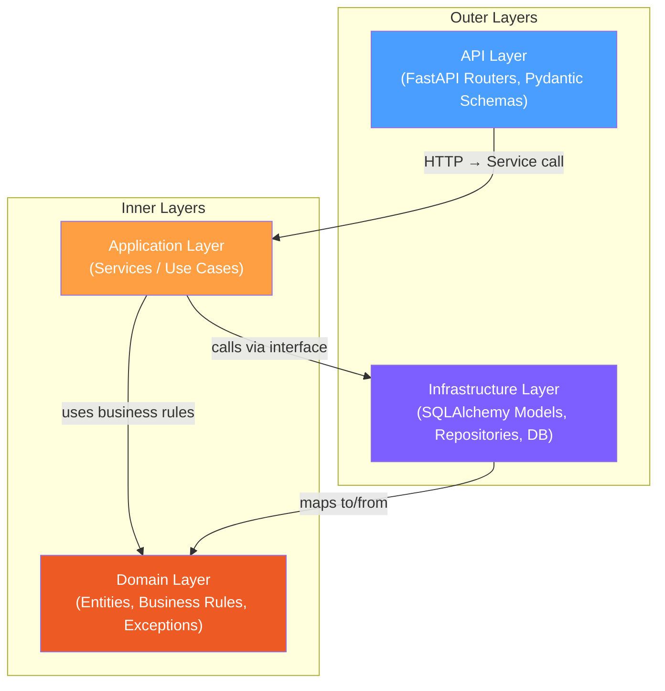
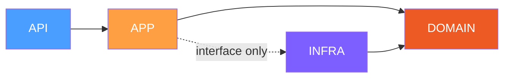
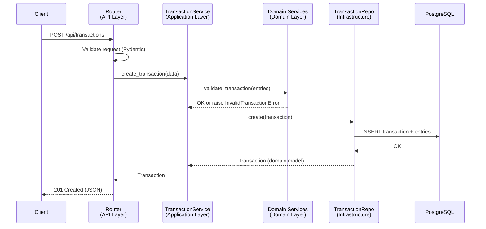

# Architecture

## Table of Contents
- [Overview](#overview)
- [Architectural Style](#architectural-style)
- [Layer Diagram](#layer-diagram)
- [Layer Responsibilities](#layer-responsibilities)
- [Dependency Rules](#dependency-rules)
- [Directory Mapping](#directory-mapping)
- [Request Flow](#request-flow)
- [Error Handling Strategy](#error-handling-strategy)
- [Related Documents](#related-documents)

## Overview

The Financial Ledger API follows **Clean Architecture** principles to separate business logic from infrastructure concerns. The primary goal is testability -- domain logic can be verified without a running database or HTTP server.

See [ADR-001: Clean Architecture](./adr/001-clean-architecture.md) for the decision rationale.

## Architectural Style

We use a **layered architecture** with strict dependency direction: outer layers depend on inner layers, never the reverse.

```
Outer (infrastructure) → Inner (domain)
```

The domain layer is the core of the application. It knows nothing about databases, HTTP, or frameworks.

## Layer Diagram



## Layer Responsibilities

### Domain Layer (`src/ledger/domain/`)

The innermost layer. Pure Python with **zero external dependencies**.

| Module | Purpose |
|---|---|
| `models.py` | `Account`, `Transaction`, `TransactionEntry` dataclasses |
| `enums.py` | `AccountType` (ASSET, LIABILITY, REVENUE, EXPENSE), `EntryType` (DEBIT, CREDIT) |
| `services.py` | `validate_transaction()`, `calculate_balance()` |
| `exceptions.py` | `UnbalancedTransactionError`, `InvalidTransactionError`, `AccountNotFoundError`, etc. |

**Rules:**
- No imports from `application`, `infrastructure`, or `api`
- No SQLAlchemy, no FastAPI, no Pydantic (for ORM/HTTP concerns)
- Uses `Decimal` for all monetary values (never `float`)
- Must be testable with plain `pytest` -- no fixtures, no DB, no HTTP

### Application Layer (`src/ledger/application/`)

Orchestrates use cases by combining domain logic with repository calls.

| Module | Purpose |
|---|---|
| `interfaces.py` | Abstract repository protocols (`AccountRepository`, `TransactionRepository`) |
| `account_service.py` | Create account, get account with balance, list accounts |
| `transaction_service.py` | Create transaction (validate + persist), get transaction, get by account |

**Rules:**
- Depends on `domain` (uses entities and business rules)
- Depends on repository **interfaces** (not implementations)
- No direct DB access, no SQL, no SQLAlchemy imports
- No HTTP concerns (no FastAPI, no status codes)

### Infrastructure Layer (`src/ledger/infrastructure/`)

Implements persistence and external integrations.

| Module | Purpose |
|---|---|
| `database.py` | Async SQLAlchemy engine, session factory, `get_db()` |
| `models.py` | SQLAlchemy ORM models (`AccountModel`, `TransactionModel`, `TransactionEntryModel`) |
| `repositories/account_repo.py` | `SQLAlchemyAccountRepository` -- implements `AccountRepository` protocol |
| `repositories/transaction_repo.py` | `SQLAlchemyTransactionRepository` -- implements `TransactionRepository` protocol |

**Rules:**
- Implements interfaces defined in `application`
- Maps between domain models and ORM models
- All DB-specific logic lives here (queries, transactions, constraints)
- Depends on `domain` for entity types

### API Layer (`src/ledger/api/`)

Thin HTTP interface. No business logic.

| Module | Purpose |
|---|---|
| `routers/accounts.py` | Account endpoints (`POST`, `GET /`, `GET /{id}`) |
| `routers/transactions.py` | Transaction endpoints (`POST`, `GET /{id}`, `GET /accounts/{id}/transactions`) |
| `schemas.py` | Pydantic v2 request/response models |
| `dependencies.py` | FastAPI dependency injection (service + repo wiring) |
| `exception_handlers.py` | Maps domain exceptions to HTTP status codes |

**Rules:**
- Route handlers are thin -- validate input, call service, return response
- No business logic (no balance calculations, no transaction validation)
- Maps domain exceptions to HTTP responses (400, 404, 409)
- Uses Pydantic schemas for request validation and response serialization

## Dependency Rules



| Rule | Description |
|---|---|
| Domain imports nothing | Zero dependencies on other layers |
| Application imports domain | Uses entities, services, exceptions |
| Application defines interfaces | Repository protocols live in application layer |
| Infrastructure imports domain | Maps ORM models to/from domain entities |
| Infrastructure implements interfaces | Concrete repositories fulfill application protocols |
| API imports application | Calls services, never domain directly for mutations |
| **Never:** inner → outer | Domain never imports infrastructure or API |

## Directory Mapping

```
src/ledger/
├── domain/                     # INNER - Pure business logic
│   ├── __init__.py
│   ├── models.py               # Account, Transaction, TransactionEntry
│   ├── enums.py                # AccountType, EntryType
│   ├── services.py             # validate_transaction(), calculate_balance()
│   └── exceptions.py           # Domain-specific errors
├── application/                # MIDDLE - Use cases
│   ├── __init__.py
│   ├── interfaces.py           # Repository protocols (ABC/Protocol)
│   ├── account_service.py      # Account use cases
│   └── transaction_service.py  # Transaction use cases
├── infrastructure/             # OUTER - DB, ORM
│   ├── __init__.py
│   ├── database.py             # Engine, session, get_db()
│   ├── models.py               # SQLAlchemy ORM models
│   └── repositories/
│       ├── __init__.py
│       ├── account_repo.py     # SQLAlchemyAccountRepository
│       └── transaction_repo.py # SQLAlchemyTransactionRepository
├── api/                        # OUTER - HTTP
│   ├── __init__.py
│   ├── schemas.py              # Pydantic request/response models
│   ├── dependencies.py         # DI wiring
│   ├── exception_handlers.py   # Domain exception → HTTP response
│   └── routers/
│       ├── __init__.py
│       ├── accounts.py         # /api/accounts
│       └── transactions.py     # /api/transactions
└── main.py                     # App factory
```

## Request Flow

Example: `POST /api/transactions` (creating a balanced transaction)



## Error Handling Strategy

Domain exceptions are raised in the domain/application layers and translated to HTTP responses in the API layer:

| Domain Exception | HTTP Status | When |
|---|---|---|
| `UnbalancedTransactionError` | 400 Bad Request | sum(debits) != sum(credits) |
| `InvalidTransactionError` | 400 Bad Request | < 2 entries, missing debit/credit, negative amount |
| `AccountNotFoundError` | 404 Not Found | Referenced account doesn't exist |
| `DuplicateAccountError` | 409 Conflict | Account name already taken |
| `ValidationError` (Pydantic) | 422 Unprocessable Entity | Malformed request body |

## Related Documents

- [Domain Model](./domain-model.md) -- entity details, balance rules, validation
- [API Specification](./api-specification.md) -- endpoint contracts
- [Project Setup](./project-setup.md) -- tooling, Docker, CI
- [Development Guide](./development-guide.md) -- workflow, branching, testing
- [ADR-001: Clean Architecture](./adr/001-clean-architecture.md)
