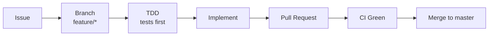
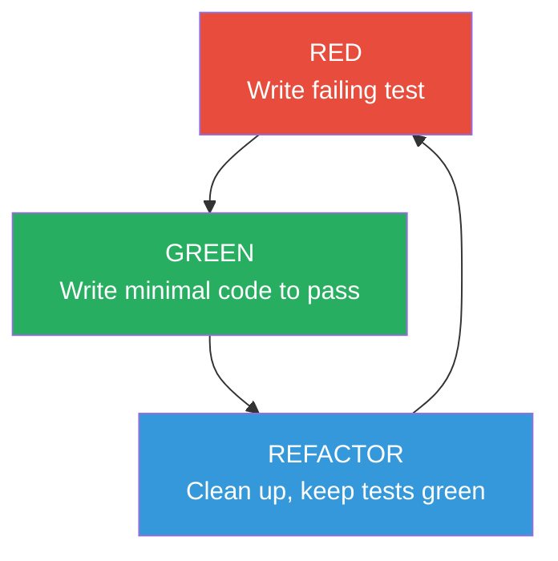

# Development Guide

## Table of Contents
- [Prerequisites](#prerequisites)
- [Getting Started](#getting-started)
- [Git Workflow](#git-workflow)
- [TDD Workflow](#tdd-workflow)
- [Running Tests](#running-tests)
- [Database Migrations](#database-migrations)
- [Code Quality](#code-quality)
- [Project Conventions](#project-conventions)
- [Related Documents](#related-documents)

## Prerequisites

- Docker & Docker Compose
- Git
- (Optional) `uv` for local IDE support

All Python dependencies run inside Docker. See [Project Setup](./project-setup.md) for full tooling details.

## Getting Started

```bash
# Clone
git clone git@github.com:dremdem/illuminati.git
cd illuminati

# Start
docker compose up -d

# Verify
curl http://localhost:8000/health
# → {"status":"ok"}
```

## Git Workflow

**One issue = one branch = one PR.** No exceptions.



### Branch Naming

```
feature/<short-description>
```

Examples: `feature/domain-models`, `feature/account-api`, `feature/balance-calculation`

### Commit Messages

Follow [Conventional Commits](https://www.conventionalcommits.org/):

```
feat: add transaction validation in domain layer
fix: handle decimal precision in balance calculation
docs: add architecture ADR for clean architecture
test: add integration tests for account repository
refactor: extract balance query into repository method
```

### Workflow Steps

```bash
# 1. Start from latest master
git checkout master
git pull origin master

# 2. Create feature branch
git checkout -b feature/my-feature

# 3. Write tests first (TDD)
# 4. Implement to make tests pass
# 5. Verify all checks pass
make check  # or: docker compose run --rm app pytest -v

# 6. Commit with meaningful message
git add <specific-files>
git commit -m "feat: description of what and why"

# 7. Push and create PR
git push -u origin feature/my-feature
gh pr create --title "feat: short title (#N)" --body "..."

# 8. Wait for CI to pass
gh pr checks <pr-number> --watch

# 9. Merge (after review)
```

### Rules

- **NEVER push directly to master**
- **NEVER force-push** to shared branches
- Keep PRs focused -- one issue per PR
- Ensure CI is green before merging

## TDD Workflow

We follow Test-Driven Development. For every feature:



### Test Layers

| Layer | Directory | What it tests | DB needed? |
|---|---|---|---|
| **Unit** | `tests/unit/` | Domain logic: validation, balance calculation, edge cases | No |
| **Integration** | `tests/integration/` | Repository layer: CRUD, constraints, queries | Yes (testcontainers) |
| **API** | `tests/api/` | Full endpoints: HTTP status codes, response shapes, error handling | Yes |

### Writing Order

For each feature (e.g., "create transaction"):

1. Write **unit tests** for domain validation (`tests/unit/test_transaction_validation.py`)
2. Implement **domain logic** (`src/ledger/domain/services.py`)
3. Write **integration tests** for repository (`tests/integration/test_transaction_repo.py`)
4. Implement **repository** (`src/ledger/infrastructure/repositories/transaction_repo.py`)
5. Write **API tests** for endpoint (`tests/api/test_transactions_api.py`)
6. Implement **router + service** (`src/ledger/api/routers/transactions.py`)

## Running Tests

```bash
# All tests
docker compose run --rm app pytest -v

# Unit tests only
docker compose run --rm --no-deps app pytest tests/unit/ -v

# Integration tests only
docker compose run --rm app pytest tests/integration/ -v

# API tests only
docker compose run --rm app pytest tests/api/ -v

# Specific test file
docker compose run --rm app pytest tests/unit/test_balance_calculation.py -v

# With coverage (when added)
docker compose run --rm app pytest --cov=ledger -v
```

Or use Makefile:

```bash
make test
```

## Database Migrations

Migrations use Alembic and run inside Docker.

```bash
# Generate a new migration (after changing ORM models)
docker compose run --rm app alembic revision --autogenerate -m "description"

# Apply all pending migrations
docker compose run --rm app alembic upgrade head

# Rollback one migration
docker compose run --rm app alembic downgrade -1

# Show current revision
docker compose run --rm app alembic current

# Show migration history
docker compose run --rm app alembic history
```

Alembic reads `DATABASE_URL` from the environment. See [Project Setup: Configuration Files](./project-setup.md#configuration-files).

## Code Quality

### Linting & Formatting

```bash
# Check lint rules
docker compose run --rm --no-deps app ruff check .

# Auto-fix lint issues
docker compose run --rm --no-deps app ruff check --fix .

# Check formatting
docker compose run --rm --no-deps app ruff format --check .

# Auto-format
docker compose run --rm --no-deps app ruff format .
```

### Type Checking

```bash
docker compose run --rm --no-deps app mypy src/
```

### All Checks at Once

```bash
make check  # lint + typecheck + test
```

## Project Conventions

| Convention | Rule |
|---|---|
| **Money** | Always `Decimal`, never `float` |
| **IDs** | UUID v4 |
| **API field names** | camelCase in JSON (Pydantic aliases), snake_case in Python |
| **Imports** | Sorted by ruff (isort rules) |
| **Type hints** | Required everywhere (mypy strict) |
| **Business logic** | Domain layer only, never in routers |
| **Balance** | Computed dynamically, never stored |
| **Errors** | Domain exceptions mapped to HTTP in API layer |

## Related Documents

- [Project Setup](./project-setup.md) -- tooling, Docker, CI details
- [Architecture](./architecture.md) -- layer diagram, dependency rules
- [Domain Model](./domain-model.md) -- entities, balance rules
- [API Specification](./api-specification.md) -- endpoint contracts
