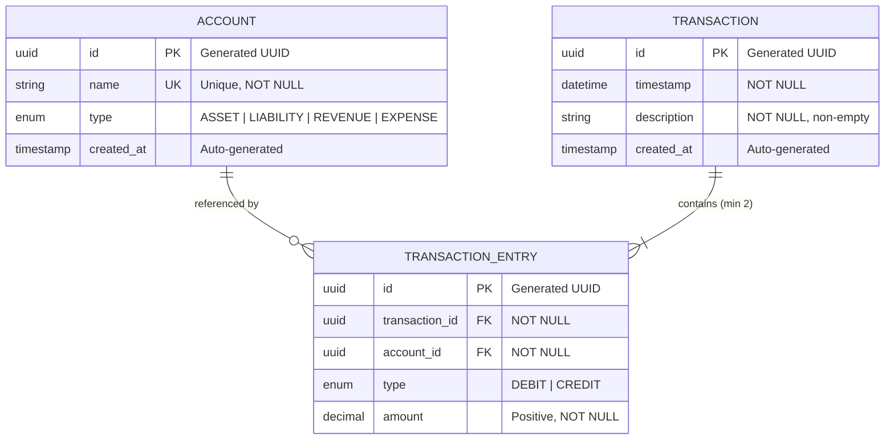
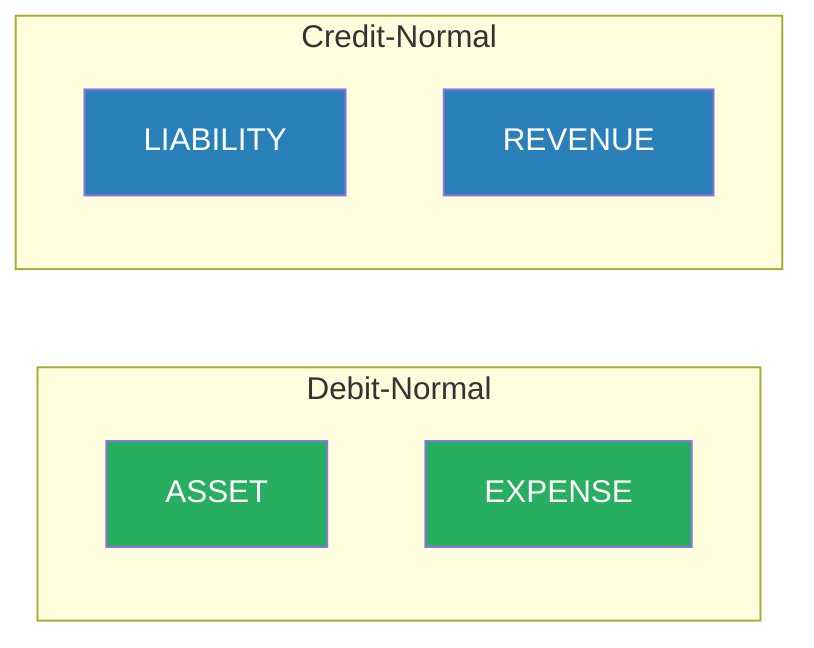

# Domain Model

## Table of Contents
- [Overview](#overview)
- [Entity Relationship Diagram](#entity-relationship-diagram)
- [Entities](#entities)
  - [Account](#account)
  - [Transaction](#transaction)
  - [TransactionEntry](#transactionentry)
- [Enumerations](#enumerations)
- [Balance Calculation](#balance-calculation)
- [Transaction Validation Rules](#transaction-validation-rules)
- [Account Validation Rules](#account-validation-rules)
- [Domain Examples](#domain-examples)
- [Related Documents](#related-documents)

## Overview

The Financial Ledger API implements **double-entry bookkeeping** -- an accounting system where every financial transaction affects at least two accounts, and the total debits must always equal the total credits. This is the fundamental invariant of the entire system.

## Entity Relationship Diagram



**Key relationships:**
- A `Transaction` **must have** at least 2 `TransactionEntry` records (one debit, one credit)
- A `TransactionEntry` belongs to exactly one `Transaction` and references exactly one `Account`
- An `Account` can be referenced by many `TransactionEntry` records

## Entities

### Account

Represents a financial account (e.g., Cash, Revenue, Expenses, Liability).

| Field | Type | Constraints | Notes |
|---|---|---|---|
| `id` | `UUID` | PK, auto-generated | Immutable after creation |
| `name` | `str` | Unique, NOT NULL, non-empty | e.g., "Cash", "Office Supplies" |
| `type` | `AccountType` | NOT NULL | Determines balance calculation direction |
| `created_at` | `datetime` | Auto-generated | Immutable |

**Critical rule:** An account's **balance is never stored**. It is always computed dynamically from the account's transaction entries. See [Balance Calculation](#balance-calculation).

### Transaction

A financial event that moves money between accounts via entries.

| Field | Type | Constraints | Notes |
|---|---|---|---|
| `id` | `UUID` | PK, auto-generated | Immutable after creation |
| `timestamp` | `datetime` | NOT NULL | When the transaction occurred |
| `description` | `str` | NOT NULL, non-empty | Human-readable description |
| `entries` | `list[TransactionEntry]` | Min 2, balanced | The debit/credit legs |
| `created_at` | `datetime` | Auto-generated | Immutable |

**Invariant:** `sum(debit amounts) == sum(credit amounts)` -- always.

### TransactionEntry

A single debit or credit leg within a transaction.

| Field | Type | Constraints | Notes |
|---|---|---|---|
| `id` | `UUID` | PK, auto-generated | Immutable |
| `transaction_id` | `UUID` | FK → Transaction | Parent transaction |
| `account_id` | `UUID` | FK → Account | Affected account |
| `type` | `EntryType` | DEBIT or CREDIT | Direction of the entry |
| `amount` | `Decimal` | Positive, NOT NULL | Always > 0, never float |

## Enumerations

### AccountType

```python
class AccountType(str, Enum):
    ASSET = "ASSET"         # Things you own (Cash, Equipment)
    LIABILITY = "LIABILITY"  # Things you owe (Loans, Accounts Payable)
    REVENUE = "REVENUE"      # Income earned (Sales, Service Revenue)
    EXPENSE = "EXPENSE"      # Costs incurred (Rent, Supplies)
```

### EntryType

```python
class EntryType(str, Enum):
    DEBIT = "DEBIT"
    CREDIT = "CREDIT"
```

## Balance Calculation

Different account types respond differently to debits and credits. This is the core accounting logic:

| Account Type | Increases With | Decreases With | Formula |
|---|---|---|---|
| **ASSET** | DEBIT | CREDIT | `sum(debits) - sum(credits)` |
| **EXPENSE** | DEBIT | CREDIT | `sum(debits) - sum(credits)` |
| **LIABILITY** | CREDIT | DEBIT | `sum(credits) - sum(debits)` |
| **REVENUE** | CREDIT | DEBIT | `sum(credits) - sum(debits)` |

**Memory aid:** ASSET and EXPENSE are "debit-normal" accounts. LIABILITY and REVENUE are "credit-normal" accounts.



### Implementation Choice

Balance is computed via **SQL aggregation** (SUM with CASE WHEN) rather than loading all entries into Python. This gives O(1) memory usage regardless of entry count. The aggregation is implemented in `AccountRepository.get_with_balance()` and `AccountRepository.get_all_with_balances()`, so `AccountService` does not depend on `TransactionRepository` for balance computation.

The domain layer's pure Python `calculate_balance()` function is preserved for unit testing.

See [ADR-002: Balance Computation](./adr/002-balance-computation.md) for the decision rationale.

### Example

Account "Cash" (ASSET) with these entries:

| Transaction | Type | Amount |
|---|---|---|
| Initial deposit | DEBIT | 1000.00 |
| Buy supplies | CREDIT | 150.00 |
| Client payment | DEBIT | 500.00 |

Balance = `(1000 + 500) - 150` = **1350.00**

## Transaction Validation Rules

Every transaction must pass **all** of these checks before persisting:

| # | Rule | Error |
|---|---|---|
| 1 | At least 2 entries | `InvalidTransactionError` |
| 2 | At least 1 DEBIT entry | `InvalidTransactionError` |
| 3 | At least 1 CREDIT entry | `InvalidTransactionError` |
| 4 | `sum(debit amounts) == sum(credit amounts)` | `UnbalancedTransactionError` |
| 5 | All amounts are positive (`> 0`) | `InvalidTransactionError` |
| 6 | Description is not empty | `InvalidTransactionError` |
| 7 | All referenced accounts exist | `AccountNotFoundError` |

Rules 1-6 are enforced in the **domain layer** (pure Python, no DB).
Rule 7 is enforced in the **application layer** (requires DB lookup).

## Account Validation Rules

| # | Rule | Error | HTTP Status |
|---|---|---|---|
| 1 | Name is not empty | `InvalidAccountError` | 400 |
| 2 | Name is unique | `DuplicateAccountError` | 409 |
| 3 | Type is valid enum value | Pydantic validation | 422 |

## Domain Examples

### Example 1: Purchase supplies for $100 cash

```
Transaction: "Purchase office supplies"
├── DEBIT:  Supplies (EXPENSE)  +100.00
└── CREDIT: Cash (ASSET)        +100.00
    Total debits = Total credits = 100.00 ✓
```

Effect on balances:
- Supplies (EXPENSE, debit-normal): balance increases by 100
- Cash (ASSET, debit-normal): balance decreases by 100

### Example 2: Receive $500 payment from client

```
Transaction: "Client payment for invoice #42"
├── DEBIT:  Cash (ASSET)        +500.00
└── CREDIT: Revenue (REVENUE)   +500.00
    Total debits = Total credits = 500.00 ✓
```

Effect on balances:
- Cash (ASSET, debit-normal): balance increases by 500
- Revenue (REVENUE, credit-normal): balance increases by 500

### Example 3: Take out a $1000 loan

```
Transaction: "Bank loan received"
├── DEBIT:  Cash (ASSET)           +1000.00
└── CREDIT: Bank Loan (LIABILITY)  +1000.00
    Total debits = Total credits = 1000.00 ✓
```

Effect on balances:
- Cash (ASSET): balance increases by 1000
- Bank Loan (LIABILITY, credit-normal): balance increases by 1000

## Related Documents

- [Architecture](./architecture.md) -- layer responsibilities and dependency rules
- [API Specification](./api-specification.md) -- HTTP contracts using these domain models
- [ADR-002: Balance Computation](./adr/002-balance-computation.md) -- SQL vs Python
