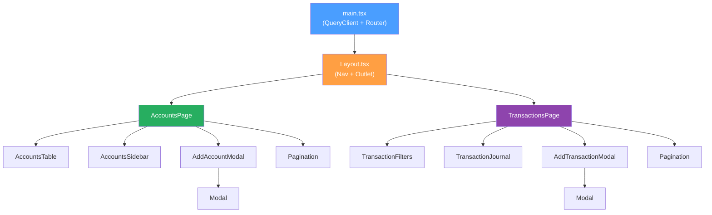
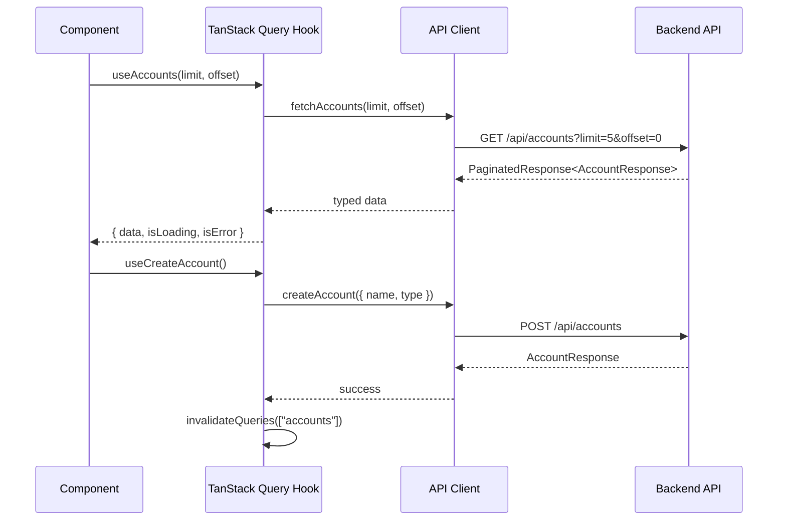

# Frontend Architecture

## Table of Contents
- [Overview](#overview)
- [Tech Stack](#tech-stack)
- [Component Hierarchy](#component-hierarchy)
- [Directory Structure](#directory-structure)
- [Data Flow](#data-flow)
- [Development Workflow](#development-workflow)
- [Docker Integration](#docker-integration)
- [Related Documents](#related-documents)

## Overview

The frontend is a React SPA that consumes the Financial Ledger API. It provides two main views — **Accounts** and **Transactions** — with modals for creating new records. Served via nginx in production (port 3000), with Vite dev server for local development (port 5173).

## Tech Stack

| Library | Purpose |
|---|---|
| Vite + React 19 + TypeScript | Build tooling + UI |
| React Router v7 | Client-side routing |
| Tailwind CSS v4 | Styling (Vite plugin, CSS-first config) |
| TanStack Query v5 | Server state, caching, pagination |

## Component Hierarchy



## Directory Structure

```
frontend/src/
├── main.tsx                    # QueryClientProvider + RouterProvider
├── index.css                   # @import "tailwindcss"
├── config.ts                   # Shared constants (DEFAULT_PAGE_SIZE)
├── router.tsx                  # createBrowserRouter
├── types/
│   └── api.ts                  # TS interfaces matching API responses
├── api/
│   └── client.ts              # Typed fetch wrapper for all endpoints
├── hooks/
│   ├── useAccounts.ts         # useAccounts, useAllAccounts, useCreateAccount
│   └── useTransactions.ts     # useTransactions, useCreateTransaction
└── components/
    ├── Layout.tsx             # Nav bar + Outlet
    ├── Modal.tsx              # Generic portal-based modal
    ├── Pagination.tsx         # Prev/Next + "Showing X-Y of Z"
    ├── accounts/
    │   ├── AccountsPage.tsx   # Table + sidebar + modal trigger
    │   ├── AccountsTable.tsx  # Paginated table with type badges
    │   ├── AccountsSidebar.tsx # Totals grouped by account type
    │   └── AddAccountModal.tsx # Name + type form
    └── transactions/
        ├── TransactionsPage.tsx      # Filters + journal + modal trigger
        ├── TransactionJournal.tsx     # Expandable rows with entry details
        ├── TransactionFilters.tsx     # Account dropdown + date range
        └── AddTransactionModal.tsx    # Dynamic entries + live balance
```

## Data Flow



Key patterns:
- **TanStack Query** handles caching, refetching, and loading states
- **`useAllAccounts()`** provides a lookup map for resolving account names in transaction entries
- Mutations invalidate related queries to keep data fresh
- Pagination uses `useState` for offset, default page size of 5 (configurable in `config.ts`)
- **Client-side date sorting** on the Transactions journal — click the "Date" column header to toggle ascending/descending order (backend returns ascending; descending is reversed client-side within the current page)

## Development Workflow

### Local Development (Vite dev server)

```bash
# Install dependencies
make frontend-install

# Start backend
make up

# Start frontend dev server (port 5173, proxies /api to :8000)
make frontend-dev
```

### Production (Docker)

```bash
# Build and start all services
make up

# Frontend available at http://localhost:3000
# API proxied through nginx to backend
```

### Build

```bash
# Production build (outputs to frontend/dist/)
make frontend-build
```

## Docker Integration

The frontend uses a multi-stage Docker build:

1. **Build stage** (`node:22-alpine`): Installs deps, runs `vite build`
2. **Serve stage** (`nginx:alpine`): Copies build output, serves with nginx

nginx configuration:
- Serves static files from `/usr/share/nginx/html`
- Proxies `/api/` requests to `app:8000` (backend service)
- SPA fallback: all other routes serve `index.html`

## Related Documents

- [Project Setup](./project-setup.md) — tech stack, Docker services, Makefile targets
- [API Specification](./api-specification.md) — endpoint contracts consumed by the frontend
- [Architecture](./architecture.md) — backend clean architecture layers
