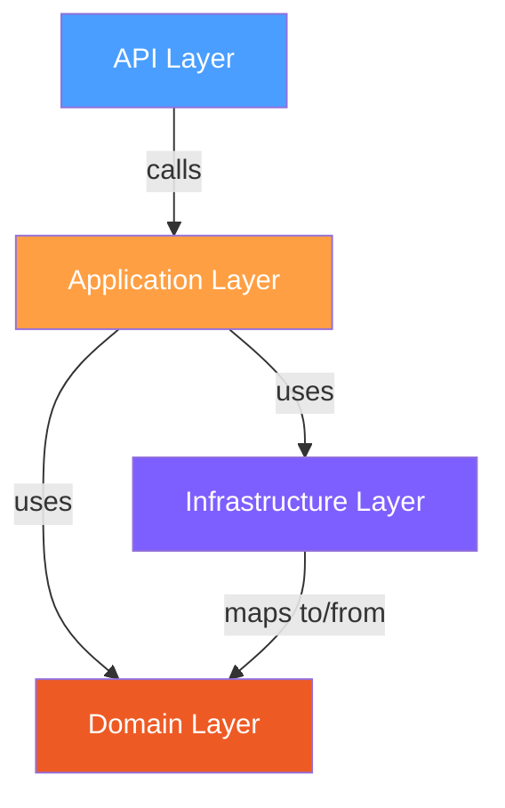
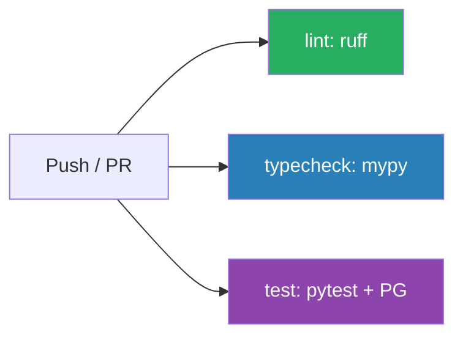

# Project Setup Guide

## Table of Contents
- [Overview](#overview)
- [Tech Stack](#tech-stack)
- [Project Structure](#project-structure)
- [Local Development](#local-development)
- [Docker Development](#docker-development)
- [CI Pipeline](#ci-pipeline)
- [Makefile Targets](#makefile-targets)
- [Configuration Files](#configuration-files)
- [Related Documents](#related-documents)

## Overview

The Financial Ledger API is a FastAPI application implementing double-entry bookkeeping. This document covers the project setup, tooling, and development workflow.

## Tech Stack

| Tool | Purpose | Version |
|---|---|---|
| Python | Runtime | 3.11+ |
| FastAPI | Web framework | 0.115+ |
| SQLAlchemy | ORM (async) | 2.0+ |
| asyncpg | PostgreSQL async driver | 0.30+ |
| Pydantic | Validation & schemas | 2.0+ |
| Alembic | Database migrations | 1.14+ |
| PostgreSQL | Database | 16 |
| uv | Dependency management | latest |
| ruff | Linting + formatting | 0.8+ |
| mypy | Static type checking (strict) | 1.13+ |
| pytest | Testing (async) | 8.0+ |

## Project Structure

```
illuminati/
├── .github/workflows/
│   └── ci.yml                  # GitHub Actions: lint, typecheck, test
├── alembic/
│   ├── versions/               # Migration scripts (auto-generated)
│   ├── env.py                  # Migration runner (reads DATABASE_URL from env)
│   └── script.py.mako          # Migration template
├── docs/                       # Project documentation
├── src/ledger/                  # Application source code
│   ├── api/                    # FastAPI routers (thin, no business logic)
│   │   └── routers/
│   ├── application/            # Service/use-case layer
│   ├── domain/                 # Business rules, entities (zero dependencies)
│   ├── infrastructure/         # DB, ORM, external concerns
│   │   └── repositories/
│   └── main.py                 # App factory + health endpoint
├── tests/
│   ├── unit/                   # Domain logic tests (no DB, no HTTP)
│   ├── integration/            # Repository tests (testcontainers + real PG)
│   ├── api/                    # Endpoint tests (httpx AsyncClient)
│   ├── conftest.py             # Shared fixtures (app factory, async client)
│   └── test_health.py          # Smoke test
├── alembic.ini                 # Alembic configuration
├── docker-compose.yml          # App + PostgreSQL services
├── Dockerfile                  # Multi-stage build with uv
├── Makefile                    # Developer convenience targets
├── pyproject.toml              # Dependencies, tool config (ruff, mypy, pytest)
├── uv.lock                     # Locked dependency versions
└── .env.example                # Environment variable template
```

### Layer Responsibilities



| Layer | Directory | Rules |
|---|---|---|
| **API** | `src/ledger/api/` | Thin routers. No business logic. Maps HTTP to service calls. |
| **Application** | `src/ledger/application/` | Orchestrates use cases. Calls domain + repositories. |
| **Domain** | `src/ledger/domain/` | Pure Python. Zero imports from other layers. Business rules live here. |
| **Infrastructure** | `src/ledger/infrastructure/` | SQLAlchemy models, repositories, DB session. Implements interfaces. |

## Local Development

> **Note:** All deps are managed inside Docker. Local `uv sync` is optional (for IDE support).

### Prerequisites
- Docker & Docker Compose
- (Optional) `uv` for local IDE tooling

### Quick Start

```bash
# Clone and start
git clone git@github.com:dremdem/illuminati.git
cd illuminati
docker compose up -d

# Verify
curl http://localhost:8000/health
# → {"status":"ok"}

# Run tests inside Docker
docker compose run --rm app pytest -v

# Stop
docker compose down
```

### Optional: Local IDE Support

```bash
# Install uv (if not installed)
curl -LsSf https://astral.sh/uv/install.sh | sh

# Install deps locally (for IDE autocomplete/type checking)
uv sync
```

## Docker Development

### Dockerfile: Two-Phase Build

The Dockerfile uses a two-phase dependency installation for optimal layer caching:

```dockerfile
# Phase 1: Install dependencies only (cached when deps don't change)
COPY pyproject.toml uv.lock README.md ./
RUN uv sync --frozen --no-install-project

# Phase 2: Install project (rebuilds when source changes)
COPY src/ src/
RUN uv sync --frozen
```

This means changing source code **does not** re-download dependencies.

### docker-compose.yml Services

| Service | Image | Ports | Purpose |
|---|---|---|---|
| `db` | postgres:16-alpine | 5432 | PostgreSQL with health check |
| `app` | (built from Dockerfile) | 8000 | FastAPI application |

The `app` service waits for `db` to be healthy before starting. Source directories (`src/`, `tests/`) are mounted as volumes for live reloading during development.

### Running Commands Inside Docker

```bash
# Run tests
docker compose run --rm app pytest -v

# Lint
docker compose run --rm --no-deps app ruff check .

# Type check
docker compose run --rm --no-deps app mypy src/

# Format code
docker compose run --rm --no-deps app ruff format .

# Open a shell
docker compose run --rm app bash
```

## CI Pipeline

GitHub Actions runs **3 parallel jobs** on every push to `master` and every PR:



| Job | What it does | Duration |
|---|---|---|
| **lint** | `ruff check .` + `ruff format --check .` | ~9s |
| **typecheck** | `mypy src/` in strict mode | ~12s |
| **test** | `pytest -v` with PostgreSQL 16 service container | ~33s |

All jobs use `astral-sh/setup-uv@v5` to install `uv` on the GitHub runner. Jobs are independent -- a lint failure does not block test execution.

### Test Job: PostgreSQL Service

The test job starts a real PostgreSQL container as a [service container](https://docs.github.com/en/actions/use-cases-and-examples/using-containerized-services/about-service-containers):

```yaml
services:
  postgres:
    image: postgres:16-alpine
    env:
      POSTGRES_USER: ledger
      POSTGRES_PASSWORD: ledger
      POSTGRES_DB: ledger_test
    options: --health-cmd="pg_isready -U ledger" ...
```

The runner waits for the health check to pass before running tests. `DATABASE_URL` is set as an environment variable at the job level.

## Makefile Targets

| Target | Command | Notes |
|---|---|---|
| `make up` | `docker compose up -d` | Start all services |
| `make down` | `docker compose down` | Stop all services |
| `make build` | `docker compose build` | Rebuild images |
| `make lint` | ruff check + format check | `--no-deps` (no DB needed) |
| `make format` | `ruff format .` | Auto-fix formatting |
| `make typecheck` | `mypy src/` | `--no-deps` (no DB needed) |
| `make test` | `pytest -v` | Requires DB |
| `make check` | lint + typecheck + test | Full validation |
| `make run` | Start uvicorn directly | `--no-deps` |

## Configuration Files

### `pyproject.toml` Key Sections

- **`[project]`** -- Package metadata and runtime dependencies
- **`[dependency-groups] dev`** -- Dev-only dependencies (pytest, ruff, mypy, etc.)
- **`[build-system]`** -- Hatchling backend with `src/` layout
- **`[tool.ruff]`** -- Line length 88, Python 3.11 target, selected lint rules (E, W, F, I, N, UP, B, SIM, TCH)
- **`[tool.mypy]`** -- Strict mode, Pydantic plugin
- **`[tool.pytest]`** -- Test paths, async auto mode

### `.env.example`

```env
POSTGRES_USER=ledger
POSTGRES_PASSWORD=ledger
POSTGRES_DB=ledger
POSTGRES_HOST=db
POSTGRES_PORT=5432
DATABASE_URL=postgresql+asyncpg://ledger:ledger@db:5432/ledger
```

### `alembic.ini` / `alembic/env.py`

Alembic reads `DATABASE_URL` from the environment (not hardcoded in `alembic.ini`). For migrations, the async driver (`+asyncpg`) is automatically swapped to the sync driver (`psycopg2`) since Alembic runs synchronously.

## Related Documents

- [Architecture](./architecture.md) *(planned -- issue #3)*
- [Domain Model](./domain-model.md) *(planned -- issue #3)*
- [API Specification](./api-specification.md) *(planned -- issue #3)*
